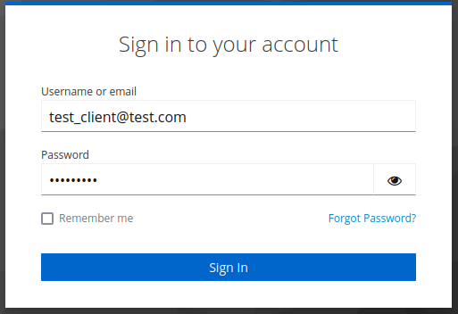

# Manually testing of OAuth authentication using KeyCloak

The Client is the Client Application connecting to the API.

The User is anyone using the Client Application.

## Authentication

There are two ways to authenticate using the oAuth endpoints.

Both of them require some human assistance due to the authentication provider, Keycloak, needing a web browser to log in.

For both, the assumption is the server is running on the host `{host}`. The API is accesible at

`https://{host}/v2/protocol`.

### First way

The first way is to use the `/login` endpoint with no parameters.

`https://{host}/v2/protocol/login`

This redirects the User to the Keycloak login page.



If the credentials are valid, the User gets automatically redirected back to the API and receives a JWT token in the response body.

```yaml
  "access_token": "eyJhbGciOiJSUzI1NiIFsInR5cCIgOiAiSldUIiwia2lkIE2iA6ICJJMzUxbWE2TkVBcW5JTlB7SlNoUUtWd2xENWl1UXpvIn0.eyJle",
  "expires_in": 300,
  "not-before-policy": 0,
  "refresh_expires_in": 2400,
  "refresh_token": "eyJhbGciGOiJIUzI1NiIsInR5cCIgOiADiSldUIiwia2lkIiA",
  "scope": "Some scope 1234",
  "session_state": "ff2cabc0-1234-40c7-abcd-7112373e3a5f",
  "token_type": "Bearer"
```

### Second way

The second way is meant for devices with no access to an internet browser. The Client uses the login endpoint with an empty device parameter

`https://{host}/v2/protocol/login?device`

The following data is sent to the Client in the response body:

```yaml
device_code:	            "devicecode123"
expires_in:	                600
interval:	                5
user_code:	                "BHVX-DVZ2"
verification_uri:	        "https://keycloak.companyxy.com/realms/somerealm/device"
verification_uri_complete:	"https://keycloak.companyxy.com/realms/somerealm/device?user_code=BHVX-DVZ2"
```

The Client sends the `verification_uri_complete` to the User. This URI redirects the User to the Keycloak login page.


The Client polls the `/login` endpoint with the `device` parameter set to the `device_code` received in the first response.

`https://{host}/v2/protocol/login?device=devicecode123`

When the User authenticates, the Client (polling the `/login` endpoint) receives the following response including `access_token`

```yaml
  "access_token": "eyJhbGciOiJSUzI1NiIFsInR5cCIgOiAiSldUIiwia2lkIE2iA6ICJJMzUxbWE2TkVBcW5JTlB7SlNoUUtWd2xENWl1UXpvIn0.eyJle",
  "expires_in": 300,
  "not-before-policy": 0,
  "refresh_expires_in": 2400,
  "refresh_token": "eyJhbGciGOiJIUzI1NiIsInR5cCIgOiADiSldUIiwia2lkIiA",
  "scope": "Some scope 1234",
  "session_state": "ff2cabc0-1234-40c7-abcd-7112373e3a5f",
  "token_type": "Bearer"
```

## Refreshing JWT tokens

The User is authenticated by one of the previously described methods and the Client has received a response from the login endpoint:

```yaml
  "access_token": "eyJhbGciOiJSUzI1NiIFsInR5cCIgOiAiSldUIiwia2lkIE2iA6ICJJMzUxbWE2TkVBcW5JTlB7SlNoUUtWd2xENWl1UXpvIn0.eyJle",
  "expires_in": 300,
  "not-before-policy": 0,
  "refresh_expires_in": 2400,
  "refresh_token": "ExampleOfARefreshToken",
  "scope": "Some scope 1234",
  "session_state": "ff2cabc0-1234-40c7-abcd-7112373e3a5f",
  "token_type": "Bearer"
```

To refresh the JWT token, the Client calls the `/token_refresh` endpoint with the `refresh_token` parameter set to value `refresh_token` from the previous response.

`https://{host}/v2/protocol/token_refresh?refresh_token=ExampleOfARefreshToken`


The Client receives new tokens in the response body:

```yaml
  "access_token": "mgRpjOkqWqRAChQ9VqQNaQvZ3kKQoWqIqAtlCQqeqi0tsQM0qI4QKRRUhCfjEM0BsDJkE3RBtJ5AtVwCCbEl0fMVEt9CFxdQv8.mgRtm",
  "expires_in": 300,
  "not-before-policy": 0,
  "refresh_expires_in": 2400,
  "refresh_token": "OtherExampleOfARefreshToken",
  "scope": "Some scope 1234",
  "session_state": "jj6gefg4-5678-84g1-efgh-1556717i7e9j",
  "token_type": "Bearer"
```

